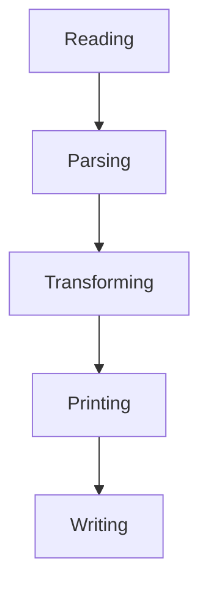

# Reading/transforming/writing JSON data

In this cookbook we will demonstrate an example of how the JSON tools provided by `fs2-data` can be used to build a mini `jq`-like CLI tool.
The full code can be found in the repository in the @:source(fs2.data.example.jqlike.JqLike) object.
This example uses [decline][decline] to parse the CLI options.

The general approach to reading/parsing/transforming/generating data with `fs2-data` can be summarized as follows:

[decline]: https://ben.kirw.in/decline/
